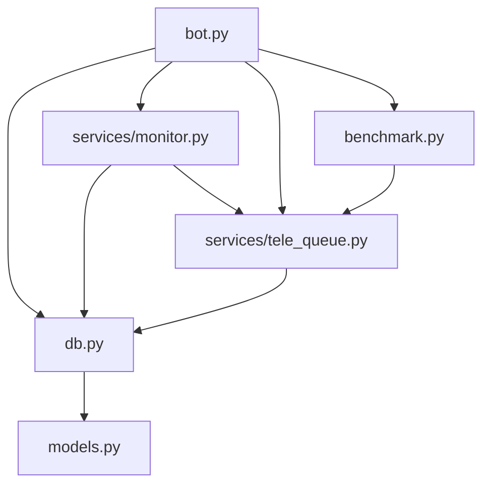

```
-----BEGIN PGP SIGNED MESSAGE-----
Hash: SHA256
```

# 📡 SysAlert Bot: TCP Service Monitoring Made Easy

<aside>
The SysAlert Monitor Bot is a production-ready Telegram bot designed to monitor TCP services and provide reliable alerting capabilities. It offers a robust, secure, and scalable solution for monitoring network services with advanced features that keep you informed about your system's health 24/7.

</aside>

## 🔍 Overview

SysAlert Monitor Bot provides real-time TCP service monitoring with intelligent alerting through Telegram. Built with Python 3.12 and modern async architecture, it's designed for reliability in production environments.

The bot supports both SQLite (for development) and PostgreSQL (for production), with a comprehensive test suite, Docker support, and CI/CD integration.

- - 👉 Who is this for?
    - System administrators managing multiple servers
    - New XPR Network validator for monitoring and ensure their node uptime and availability
- - [ ]  ⭐ Star the repository if you find it useful!

## ✨ Key Features

### Core Capabilities

- - 🔌 **TCP Monitoring**: Watches specified IP:port combinations with configurable intervals
- - ⚡ **Asynchronous Checks**: Handles many concurrent checks with semaphore-based limits
- - 🔔 **Intelligent Alerting**: Sends alerts based on failure thresholds and recovery notifications
- - 📊 **Historical Logging**: Stores check results for analytics and troubleshooting
- - 🔍 **Audit Trails**: Logs all administrative actions for accountability

### Technical Features

- - 📨 **Message Queue**: Implements rate limiting and exponential backoff for reliable delivery
- - 🐳 **Docker Support**: Runs as a non-root user with health checks
- - 🧪 **Test Suite**: Comprehensive tests covering all critical components
- - 🔒 **Security**: Admin-only access, parameterized queries, no secrets in code
- - 🔄 **CI/CD**: GitHub Actions workflow for linting and testing
- - 🔀 **Migration Support**: Tools to migrate from YAML-based configurations to database

## 📁 Project Structure

```bash
SysAlert/
├── bot.py                    # Main bot entrypoint
├── db.py                     # Database wrapper with SQLAlchemy
├── models.py                 # SQLAlchemy ORM models
├── benchmark.py              # CPU benchmark monitoring
├── services/
│   ├── __init__.py           # Services package
│   ├── monitor.py            # TCP monitoring logic
│   └── tele_queue.py         # Message queue with rate limiting
├── scripts/
│   ├── __init__.py           # Scripts package
│   ├── add_subscriber.py     # Admin script to add subscribers
│   └── migrate_yaml_to_db.py # Script to migrate YAML configs to DB
├── tests/
│   ├── __init__.py           # Tests package
│   ├── conftest.py           # Pytest fixtures
│   ├── test_db_subscriptions.py # Database operation tests
│   ├── test_monitor_tcp.py    # TCP monitoring tests
│   ├── test_benchmark.py      # CPU benchmark parsing tests
│   └── test_tele_queue.py    # Message queue tests
├── requirements.txt           # Python dependencies
├── schema.sql                 # Database schema
├── .env.example              # Example environment file
├── config.yaml.example       # Example configuration file
├── Dockerfile                # Docker configuration
├── docker-compose.yml        # Development Docker Compose
├── docker-compose.prod.yml   # Production Docker Compose
├── .github/workflows/ci.yml   # CI/CD configuration
├── Makefile                  # Build and run shortcuts
├── pytest.ini                # Pytest configuration
├── README.md                 # Project overview
├── RUN_STEPS.txt             # Detailed operational steps
├── ACCEPTANCE_CHECKLIST.md   # Acceptance criteria
├── alembic.ini               # Alembic configuration (optional)
├── monitor-bot.service       # Systemd service file
├── MIGRATION_NOTES.md        # Migration guide from v1
├── SECURITY.md               # Security policy
└── .editorconfig             # Editor configuration

```

## 🚀 Installation

### Prerequisites

| 🐍 Python | 3.12 or higher |
| --- | --- |
| 🗄️ Database | SQLite 3 (development) or PostgreSQL 15 (production) |
| 🤖 Telegram Bot Token | Obtain from[BotFather](https://t.me/BotFather) |
| 🐳 Docker | Optional, for containerized deployment |
| 📂 Git | For cloning the repository |

### 📋 Local Setup

- - 1️⃣ Clone Repository
    
    ```bash
    git clone https://github.com/turlebp/SysAlert
    cd SysAlert
    ```
    
- - 2️⃣ Create Virtual Environment
    
    ```bash
    python3.12 -m venv .venv
    source .venv/bin/activate  # On Windows: .venv\Scripts\activate
    ```
    
- - 3️⃣ Install Dependencies
    
    ```bash
    make install
    ```
    
- - 4️⃣ Configure Environment
    
    ```bash
    cp .env.example .env
    nano .env
    ```
    
    Set the following in .env:
    
    - 🔑 **TELEGRAM_TOKEN**: Your bot token from BotFather
    - 👤 **ADMIN_USER_IDS**: Comma-separated Telegram user IDs for admins
    - 🔐 **ADMIN_API_KEY**: A secure random string for script authentication
    - ⚙️ Other optional settings (see .env.example)
- - 5️⃣ Initialize Database
    
    ```bash
    mkdir -p data
    sqlite3 ./data/bot.db < schema.sql
    ```
    
- - 6️⃣ Run Tests
    
    ```bash
    make test
    ```
    
- - 7️⃣ Start Bot
    
    ```bash
    make run
    ```
    

### 🐳 Docker Setup

<aside>
Docker provides an easy way to deploy SysAlert Bot in a containerized environment, ensuring consistency across different systems.

</aside>

- - Build and Run
    
    ```bash
    cp .env.example .env
    nano .env  # Configure as above
    make docker-build
    make docker-run
    ```
    
- - View Logs
    
    ```bash
    make docker-logs
    ```
    
- - Stop Containers
    
    ```bash
    make docker-stop
    ```
    

### 🏢 Production Deployment (Docker with PostgreSQL)

- - Configure Production Compose
    
    ```bash
    cp docker-compose.yml docker-compose.prod.yml
    nano docker-compose.prod.yml  # Update DB credentials
    ```
    
- - Create Secrets
    
    ```bash
    mkdir -p secrets
    echo "your_bot_token" > secrets/telegram_token.txt
    echo "your_api_key" > secrets/admin_api_key.txt
    echo "db_password" > secrets/db_password.txt
    chmod 600 secrets/*
    ```
    
- - Start Services
    
    ```bash
    docker-compose -f docker-compose.prod.yml up -d
    ```
    
- - Initialize Database
    
    ```bash
    docker-compose -f docker-compose.prod.yml exec postgres psql -U user -d monitordb -f /schema.sql
    ```
    

## ⚙️ Configuration

### Environment Variables

| **Variable** | **Required** | **Default** | **Description** |
| --- | --- | --- | --- |
| TELEGRAM_TOKEN | Yes | - | Telegram bot token |
| ADMIN_USER_IDS | Yes | - | Comma-separated admin user IDs |
| ADMIN_API_KEY | Yes | - | API key for admin scripts |
| DB_URL | No | sqlite:///./data/bot.db | Database connection string |
| LOG_LEVEL | No | INFO | Logging level (DEBUG, INFO, WARNING, ERROR) |
| MAX_CONCURRENT_CHECKS | No | 50 | Maximum concurrent TCP checks |
| MIN_INTERVAL_SECONDS | No | 20 | Minimum check interval |
| TELE_WORKERS | No | 3 | Number of message queue workers |
| CPU_BENCH_ENABLED | No | true | Enable CPU benchmark monitoring |
| CPU_BENCH_URL | No | - | CPU benchmark API URL |
| CPU_BENCH_THRESHOLD_SECONDS | No | 0.35 | CPU benchmark alert threshold |
| CPU_BENCH_INTERVAL | No | 300 | CPU benchmark check interval |

### Configuration File

The config.yaml file contains non-sensitive defaults. Copy config.yaml.example to config.yaml and customize if needed. Environment variables override these settings.

## 📱 Usage

### 👑 Admin Operations

Admins (identified by ADMIN_USER_IDS) can manage subscriptions and configurations.

- - Adding a Subscriber
    - Via Script:
        
        ```bash
        python scripts/add_subscriber.py YOUR_API_KEY YOUR_CHAT_ID
        ```
        
    - Via SQL:
        
        ```bash
        sqlite3 ./data/bot.db "INSERT OR IGNORE INTO subscriptions (chat_id, created_at) VALUES (123456789, strftime('%s', 'now'));"
        ```
        
    - Via Bot Command:
        
        ```bash
        /addsub 123456789
        ```
        
- - Removing a Subscriber
    
    ```bash
    /rmsub 123456789
    ```
    
- - Viewing Bot Statistics
    
    ```bash
    /stats
    ```
    
- - Configuring Targets
    
    Use SQL to add targets for a customer:
    
    ```sql
    INSERT INTO customers (chat_id, interval_seconds, failure_threshold)
    VALUES (123456789, 60, 3);
    
    INSERT INTO targets (customer_id, name, ip, port, enabled)
    SELECT id, 'Production Server', '37.187.226.41', 9876, 1
    FROM customers WHERE chat_id = 123456789;
    ```
    

### 👤 User Commands

| **Command** | **Description** |
| --- | --- |
| /start | Displays welcome message and instructions |
| /whoami | Shows chat ID and subscription status |
| /status | Lists monitored targets and their status |
| /history | Shows recent check history (last 10 checks) |
| /help | Lists available commands |

## 🗄️ Database Schema

The database schema is defined in schema.sql and implemented via SQLAlchemy ORM in [models.py](https://github.com/turlebp/SysAlert/blob/main/models.py). Key tables include:

- - 📝 **subscriptions**: Tracks authorized chat IDs
- - 👥 **customers**: Stores per-user monitoring configurations
- - 🎯 **targets**: Defines IP:port targets to monitor

- - 📊 **history**: Records check results for analytics
- - 📜 **audit_logs**: Logs administrative actions
- - ⚙️ **configs**: Stores key-value configuration pairs

<aside>

### Schema Highlights

- - ⏱️ Uses integer Unix timestamps for consistency
- - 🔗 Enforces foreign key constraints
- - 🚀 Includes indexes for performance
- - 📄 Supports SQLite WAL mode for concurrency
- - 🗑️ Cascade deletes for customer targets
</aside>

## 🔧 Technical Details

### Architecture

- - 🔄 **Asyncio-Based**: Uses python-telegram-bot v20+ with asyncio for non-blocking operations
- - 🔒 **SQLAlchemy ORM**: Thread-safe database operations with scoped sessions
- - 📨 **TeleQueue**: Custom message queue with rate limiting and exponential backoff

- - 🔍 **Monitor Service**: Asynchronous TCP checks with semaphore-based concurrency control
- - 📊 **CPU Benchmark**: Monitors provider performance with configurable thresholds

### Key Components



- - 🤖 **bot.py**: Main entrypoint, handles Telegram commands and lifecycle
- - 🗄️ **db.py**: Database wrapper with thread-safe session management
- - 📊 **models.py**: SQLAlchemy models for database tables
- - 🔍 **services/monitor.py**: TCP check logic and scheduler
- - 📨 **services/tele_queue.py**: Message queue for reliable Telegram delivery
- - ⚡ **benchmark.py**: CPU benchmark monitoring and parsing
- - 📜 **scripts/**: Admin tools for subscription and migration
- - 🧪 **tests/**: Comprehensive test suite with pytest

### Security Features

<aside>

- - 🔐 **No Auto-Subscribe**: Requires admin approval
- - 👤 **Admin Authentication**: Based on user ID whitelist
- - 💉 **Parameterized Queries**: Prevents SQL injection
- - 👽 **Non-Root Docker**: Runs with minimal privileges
- - ✅ **Input Validation**: Validates IPs and ports
- - 🔑 **No Secrets in Code**: Uses environment variables
</aside>

## 🧪 Testing

The project includes a comprehensive test suite in the tests/ directory, covering database operations, TCP checks, queue functionality, and benchmark parsing.

- - Running Tests
    
    ```bash
    make test
    ```
    
- - Test Coverage
    
    ```bash
    pytest --cov=. --cov-report=html
    ```
    

<aside>

### Key Test Files

- - 🗄️ **test_db_subscriptions.py**: Tests subscription and customer CRUD
- - 🔌 **test_monitor_tcp.py**: Tests TCP check functionality
- - 📊 **test_benchmark.py**: Tests CPU benchmark parsing
- - 📨 **test_tele_queue.py**: Tests message queue operations
- - ✅ **test_validation.py**: Tests input validation
</aside>

## 🚀 Deployment

### 🐳 Docker Deployment

- - Build and Run
    
    ```bash
    make docker-build
    make docker-run
    ```
    
- - Production Setup
    
    ```bash
    docker-compose -f docker-compose.prod.yml up -d
    ```
    

### 🖥️ Systemd Service

- - Install Service
    
    ```bash
    sudo cp monitor-bot.service /etc/systemd/system/
    sudo cp .env /etc/monitor-bot.env
    sudo chmod 600 /etc/monitor-bot.env
    ```
    
- - Start Service
    
    ```bash
    sudo systemctl daemon-reload
    sudo systemctl enable monitor-bot
    sudo systemctl start monitor-bot
    ```
    
- - Check Status
    
    ```bash
    sudo systemctl status monitor-bot
    ```
    

## 📊 Monitoring and Maintenance

### Health Checks

Use /stats command to view:

- - Number of subscriptions and customers
- - Total targets
- - Queue statistics (sent, failed, dropped)

Docker health checks verify process status.

### Logs

Logs are written to bot.log and stdout:

```bash
tail -f bot.log

```

### Database Maintenance

- - Clean Old History
    
    ```sql
    DELETE FROM history WHERE timestamp < strftime('%s', 'now', '-30 days');
    ```
    
- - View Audit Logs
    
    ```sql
    SELECT datetime(created_at, 'unixepoch'), actor_chat_id, action, details
    FROM audit_logs
    ORDER BY created_at DESC
    LIMIT 20;
    ```
    

### Backups

- - SQLite
    
    ```bash
    cp data/bot.db data/bot.db.backup.$(date +%Y%m%d)
    ```
    
- - PostgreSQL
    
    ```bash
    docker-compose -f docker-compose.prod.yml exec postgres pg_dump -U user monitordb > backup.sql
    ```
    

## 🔍 Troubleshooting

- - Bot Not Responding
    - Check Token:
        
        ```bash
        cat .env | grep TELEGRAM_TOKEN
        ```
        
    - Check Logs:
        
        ```bash
        tail -f bot.log | grep ERROR
        ```
        
    - Verify Process:
        
        ```bash
        ps aux | grep bot.py
        ```
        
- - Database Locked
    
    ```bash
    sqlite3 data/bot.db "PRAGMA journal_mode=WAL;"
    sqlite3 data/bot.db "PRAGMA wal_checkpoint(TRUNCATE);"
    ```
    
- - Rate Limiting Errors
    
    Increase workers or adjust intervals in .env:
    
    ```bash
    TELE_WORKERS=5
    MAX_CONCURRENT_CHECKS=100
    ```
    
- - Test Failures
    
    ```bash
    pytest -v --tb=long
    ```
    

## 🔄 Migration from v1

See MIGRATION_NOTES.md for detailed steps. Key points:

- - 📦 Backup old data (database and YAML config)
- - 📝 Migrate subscriptions via SQL
- - 🔄 Migrate targets using migrate_yaml_to_db.py
- - 🧪 Test thoroughly before switching over

## 🔒 Security

See [SECURITY.md](https://github.com/turlebp/SysAlert/blob/main/security.md) for detailed security measures. Key points:

- - 👑 Admin-only commands and scripts
- - 🤐 No secrets in code or logs
- - 💉 Parameterized SQL queries
- - 👽 Non-root Docker user
- - ✅ Input validation for IPs and ports

## 📈 Scaling Considerations

- - 🎯 **High Target Count**: Increase MAX_CONCURRENT_CHECKS and TELE_WORKERS
- - 🏢 **Production Database**: Use PostgreSQL for better concurrency
- - 🔒 **Distributed Locking**: Consider Redis for multiple instances


Created by turtlebp for xpr network. 
contact us if there is any problems or suggestions


>
>PLEASE KEEP IN MIND THIS SOFTWARE IS A FREE AND LICENSED UNDER GPL V3 LICENSE.
> NEVER TRY TO RE-DISTRIBUTE IT AS A CLOSED SOURCE SOFTWARE
>
